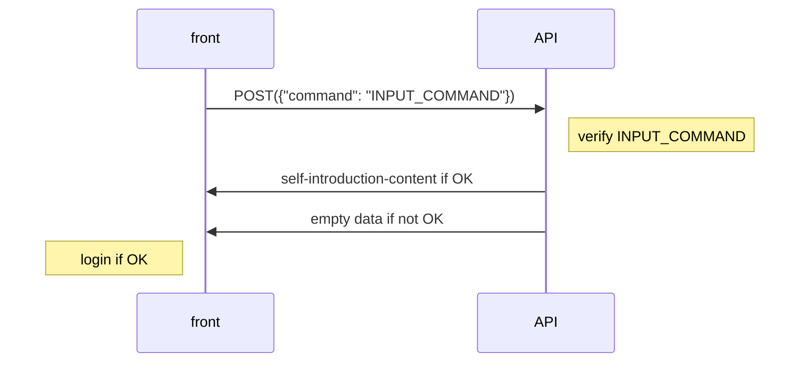

## 先日、
大学の課題で (簡単な) 自己紹介ページを作って公開するというものが出されました。今思えばインデックスされないようにすればいい話なのですが、当時はその発想がなく、個人情報保護をどう実現するかということで~~そのついでにどんな技術を勉強しようかとワクワクして~~頭がいっぱいでした。
:::message
「htmlファイルを提出する」という要件があったため、課題の趣旨からすると100%自分で直接書いたhtmlファイルを出すべきだろうと考えて index.html を直書きしたので、以下TypeScriptではなくJavaScriptが登場します。
:::
最終的にログイン機能をつくることにしました。ログイン画面のデザインとしては、以前から温めていたターミナル風`textarea`というアイデアを採用しました。ログイン処理の流れは以下の通りです。



## 実際に動くもの
をここに置いておきます。ホスト先には使い慣れたVercelを採用しました。
https://self-introduction-osz2aqgry-kana-rus.vercel.app
/*
Heroku の CofigVars　の、特に MY_NAME を書き換えておく
*/

html は以下の通りです (冗長にならないよう、CSS は説明に必要な部分以外省略します)。

```html:index.html
<!DOCTYPE html>
<html lang="ja">
<head>
  <meta charset="UTF-8">
  <meta name="viewport" content="width=device-width, initial-scale=1.0">
  <title>自己紹介</title>
  <style>
    .login-modal {
        position: absolute;
        width: 100%;
        height: 100%;
        transform: translateX(-1.5px) translateY(-1px);
        /* 原因不明の隙間への暫定対策 */
        
        border: solid;
        background-color: black;
        outline: none;

        padding: 5%;
        color: azure;
        font-size: 1.6em;
    }
    main {
        display: none; /* default */
    }

    <!--略-->

  </style>
</head>
<body onload="handleLoginCache()">
  <textarea class="login-modal" oninput="checkInput()"></textarea>
  <main>
    <div class="header">
      <div class="title-column">
        <div class="title">
          <p class="title-line">自己</p>
          <p class="title-line">紹介</p>
        </div>
      </div>
      <div class="name-column">
        <p class="my-name"></p>
      </div>
    </div>
    <span>
      <div class="card background-card">
        <h2 class="card-title">来歴</h2>
        <ul class="card-ul">
        </ul>
      </div>
      <div class="card hobby-card">
        <h2 class="card-title">趣味</h2>
        <ul class="card-ul">
        </ul>
      </div>
    </span>
  </main>
  <script>
    const apiURL = 'https://selfintroduction-loginapi.herokuapp.com/'
    const strageKeyBody = 'SelfIntroduction'
    const devLoginCommand = 'login --dev'

    const loginModal = document.getElementsByTagName('textarea')[0]
    const mainElement = document.getElementsByTagName('main')[0]
    const myNameArea = document.getElementsByTagName('p')[2]
    const ulElems = document.getElementsByTagName('ul')
    const backgroundUl = ulElems[0]
    const hobbyUl = ulElems[1]

    let pastInputLen = 0

    function handleLoginCache() {
      let loginMemory = checkStrage('loggedin')
      if (loginMemory==='yes') {
        loginWith(
          checkStrage('myname'),
          checkStrage('background').split(','),
          checkStrage('hobby').split(',')
        )
      } 
    }
    function checkInput() {
      const allInputCommands = loginModal.value
      const inputCommand = allInputCommands.slice(pastInputLen)
      if (inputCommand.slice(-1)==='\n') {
        verify({ command: inputCommand.slice(0, -1) })
         .then(res => {
           if (res["loggedin"] === 'yes') {
             loginWith(res["myname"], res["background"], res["hobby"])
             Object.keys(res).forEach(keyName => {
               sessionStorage.setItem(strageKeyBody+keyName, res[keyName])
               /*
               ここで、sesssionStrage の value は string しか許されないため、
               配列は自動的に csv 形式の文字列に変換されて格納される
               */
             })
           } else {
             pastInputLen = allInputCommands.length
           }
         })
      }
    }

    function checkStrage(key) {
      return sessionStorage.getItem(strageKeyBody+key)
    }
    async function verify(data) {
      const responseBody = await fetch(apiURL, {
        method: 'POST',
        body: JSON.stringify(data)
      })
      return responseBody.json()
    }
    function loginWith(myName, backgroundData, hobbyData) {
      myNameArea.appendChild(document.createTextNode(myName))
      backgroundData.forEach(bg => {
        newBackgroundLi = document.createElement('li')
        newBackgroundLi.appendChild(document.createTextNode(bg))
        backgroundUl.appendChild(newBackgroundLi)
      })
      hobbyData.forEach(hb => {
        newHobbyLi = document.createElement('li')
        newHobbyLi.appendChild(document.createTextNode(hb))
        hobbyUl.appendChild(newHobbyLi)
      })
      login()
    }
    function login() {
      loginModal.style.display = 'none'
      mainElement.style.display = 'initial'
    }
  </script>
</body>
</html>
```
命名について
- `res["loggedin"]` -> `res["can_login"]`, `res["judge"]` など
- `backgroundData` -> `myBackgroundInfo`

とか、実装面で
- `loginWith()` を呼び出す側が引数ごとに `split` するかしないか判断しないといけなくなっている

といった提出日に追われて直せなかった問題点が残っているので、この記事が読まれる時点ではかなり違ったコードになっているかもしれません。

/*
pastInputLen とか login() とかの説明
*/

## API側
はGoで書いて、Herokuでホスト + GASで定期fetch してます。今回勉強したのはここで、実は今まで

- requestによってresponseを変えるAPI
- `CORS`が絡むAPI

を自分で実装したことがなかったので、経験できてよかったです。コードは以下の通りです。

```go:main.go
package main

import (
    "encoding/json"
    "fmt"
    "io/ioutil"
    "net/http"
    "os"
    "strings"
)

type requestType struct {
    Command string `json:"command"`
}
type responseType struct {
    LoggedIn     string `json:"loggedin"`
    MyName       string `json:"myname"`
    Background []string `json:"background"`
    Hobby      []string `json:"hobby"`
}

var (
    loginCommand   = os.Getenv("LOGIN_COMMAND")
    port           = os.Getenv("PORT")
    myName         = os.Getenv("MY_NAME")
    backgroundData = strings.Split(os.Getenv("BACKGROUND_CSV"), ",")
    hobbyData      = strings.Split(os.Getenv("HOBBY_CSV"), ",")
    applicationURL = "https://self-introduction-osz2aqgry-kana-rus.vercel.app"
)

func main() {
    http.HandleFunc("/", requestHandler)
    http.ListenAndServe(":"+port, nil)
}

func requestHandler(rw http.ResponseWriter, req *http.Request) {
    body, err := ioutil.ReadAll(req.Body)
    if err != nil {
    	http.Error(rw, err.Error(), http.StatusInternalServerError)
    	return
    }
    jsonBytes := body
    /*
    	これは byte[] なので、たとえば
    	    {"command":"login"}
    	なら
    	    [123 34 99 111 109 109 97 110 100 34 58 32 34 108 111 103 105 110 34 125]
    */
    inputCommand := string(jsonBytes[12:len(jsonBytes)-2])    
    var loggedInOrNot string
    if inputCommand == loginCommand {
    	loggedInOrNot = "yes"
    } else {
    	loggedInOrNot = "no"
    	myName = ""
    	backgroundData = nil
    	hobbyData = nil
    }
    response, err := json.Marshal(responseType{
    	LoggedIn: loggedInOrNot,
    	MyName: myName,
    	Background: backgroundData,
    	Hobby: hobbyData,
    })
    if err != nil {
    	http.Error(rw, err.Error(), http.StatusInternalServerError)
    	return
    }    
    rw.Header().Set("Access-Control-Allow-Origin", applicationURL)
    fmt.Fprintf(rw, "%v\n", string(response))
}
```
```js:main.gs
function awakeHeroku() {
  deletePastTriggers()
  setTrigger()
  UrlFetchApp.fetch('https://selfintroduction-loginapi.herokuapp.com/')
}

function deletePastTriggers() {
  const triggers = ScriptApp.getProjectTriggers()
  for (const trigger of triggers) {
    ScriptApp.deleteTrigger(trigger)
  }
}
function setTrigger() {
  let setTime = new Date()
  setTime.setMinutes(setTime.getMinutes() + 25)
  // これで時・日への繰り越しも含めて処理してくれる

  ScriptApp.newTrigger('awakeHeroku')
           .timeBased()
           .at(setTime)
           .create()
}
```
*GASのシンタックスハイライトは、jsコードとして認識させることで擬似的に実現してます*

<br>

どうせこうなるならhtml直書き縛りはほとんど意味がなかった等、後悔は色々ありますが、単純なフロントエンド・バックエンド間の通信を自分の手で実装できてよかったと思っています。最後まで読んでいただきありがとうございました。