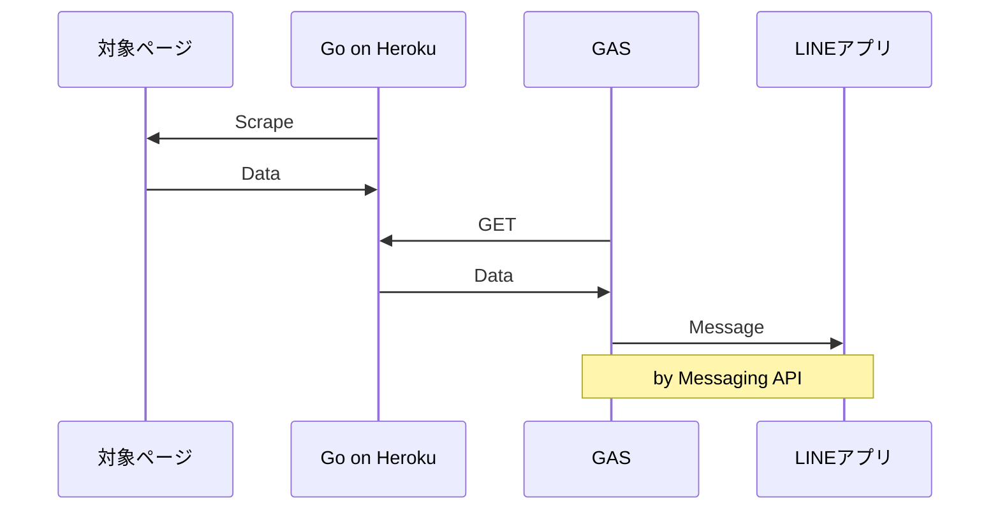

初投稿です。よろしくお願いします。
# Introduction
大学入試が終わって合格発表を待ってる期間って暇ですよね。僕は暇でした。それで、せっかくなので高校生最後の思い出になるものを作りたいと思って、こんなことを考えました。
### Plan：
1. 合格発表ページをスクレイピングして合格した番号の一覧と自分の合否を調べるコードを書く
2. １のデータを返すAPIを作る
3. ２のAPIを叩いてデータを取得し、メッセージとしてLINEに送る仕組みを作る

で、発表時刻ちょうどに自動で１，２，３が実行されるようにしておけば、他の人間たちがアクセスしてページが重くなる前に必要な情報を取得して、ゆっくりLINEで眺めることができるというわけです。ちなみに、１でデータを取得したならそのまま直接 LINE MessagingAPI を叩けばいいところですが、「1：**Go**入門としてGoでスクレイピングしてみたい」「2：API作ってみたい」「3：**MessagingAPI**使ってみたい」という動機があり、API をつくる (ごく簡単なものですが) 経験をするためにこの構成にしました。
対象ページは[京大工学部の合格発表ページ](https://daigakujc.jp/pa.php?u=31&h=24&f=19)です(3/17 17:00まで掲載)。また、２では**Heroku**、３では**GAS**を採用しました。

GASも初めて触りましたが、これはほぼJSでそこまで困ることなく書けたので、完成したコードを示すに留め、この記事では１のスクレイピングに焦点を当てたいと思います。

```gs:main.gs
let apiURL = PropertiesService.getScriptProperties().getProperty('API_URL')
let userID = PropertiesService.getScriptProperties().getProperty('USER_ID')
let accessToken = PropertiesService.getScriptProperties().getProperty('CHANNEL_ACCESS_TOKEN')

function main() { // 3/10 12:00 実行
  Utilities.sleep(3 * 1000) // スクレイピング完了を待つ (３秒はちょっと長め)
  let jsonData = GetJSONdata(apiURL)

  let idList = jsonData["id_list"]
   // MessagingAPI の文字数制限 (５０００文字) のため２回にわけて送る
  let message1 = idList.slice(0,501).join("\n")
  PushMessage(message1)
  let message2 = idList.slice(501).join("\n")
  PushMessage(message2)

   // 合格or不合格
  let passed = jsonData["passed"]
  let result = ""
  if (passed) {
    result = "合格"
  } else {
    result = "不合格"
  }
  PushMessage(result)
}

function AwakeHeroku(){ // 3/10 11:45 実行
  UrlFetchApp.fetch(apiURL)
}


function GetJSONdata(url){
  let res = UrlFetchApp.fetch(url).getContentText()
  return JSON.parse(res)
}

function PushMessage(messageText){
  let url = 'https://api.line.me/v2/bot/message/push'
  let headers = {
    'Content-Type': 'application/json; charset=UTF-8',
    'Authorization': 'Bearer ' + accessToken,
  }
  let postData = {
    'to': userID,
    'messages': [{
      'type': 'text',
      'text': messageText,
    }]
  }
  let options = {
    'method': 'post',
    'headers': headers,
    'payload': JSON.stringify(postData)
  }
  return UrlFetchApp.fetch(url, options)
}
```
:::message
- GAS は Zenn のシンタックスハイライト未対応
- Property と Trigger (timeBased) は別ファイルで設定済
:::

# Scraping
### 情報収集
では本題に入ります。早速ですが、重大な問題があります。勘のいい方or京大の先輩方は気づいたかもしれませんが、合格発表前はそもそも対象ページがWeb上に存在しません。ページ自体が合格発表のタイミングで公開されるので、事前にURLも分かりませんし、HTMLの構造も当然分かりません。これでは話が進まないので、YouTubeで京大の合格発表ページが写っている動画を探しまくって情報収集しました。その結果分かったことは、
- 発表時刻に、[このページ](https://daigakujc.jp/pal.php?u=31&h=24)に各学科名のリンクが並ぶ (：**Aページ**とする)

*発表前*
- "工学部"のリンクで飛んだ先が工学部の発表ページ。そのURLは上記ページのURLにクエリパラメータ"f=整数"がくっついた形をしているが、これは毎年同じとは限らないかもしれないとなると、予想がつかない
- 発表ページ自体は、簡単な説明と縦に並んだ番号があるだけ (：**Bページ**とする)

*これは発表後に撮った実際の写真だが、こんな感じのページだということは動画で事前に確認できた* 

くらいです。この条件で、発表の瞬間にBページから
- 合格した番号+アルファベット(画像参照) の一覧
- 自分の合否

を取得するのが目標です。前者ができれば後者は容易なので、前者をなんとかすることを考えることになります。Go の基礎文法をざっと勉強してから、Go でのスクレイピングにはどんな package が使えるか調べてみたところ、**goquery** という package が、Github のスター数が十分多く、最終更新が去年の10月 (執筆時点) で安定してそう、かつネット上の日本語記事数の点では頭一つ抜けているように感じたので、今回はこれを採用することにしました。

### 構想
ということで、goquery に慣れるべくいろいろ書いてみながら、今回の目標を達成するために次のような方針を立てました。

1. Aページをスクレイピングし、「text が"工学部"となっている a タグの href」を取得する。
2. 必要なら href を"https://..."の形に加工する。このURLでBページをスクレイピングすることができる。
3. Bページをスクレイピングし、合格した「受験番号+アルファベット」(：**ID**とする) のリストを取得する。

ただし、最初に書いたようにBページのHTMLは事前に分からないため、ここは想像に頼るしかないです。当然テストも不可能です。僕は、先程の写真のイメージから以下のようなHTMLを想定しました。

```html:bpage.html
<!--略-->
<body>
    <hN class="school">工学部</hN>
    <p>[合格者番号一覧]</p>
    <p>受験番号の後のアルファベットは、合格した学科を表す。</p>
    <p>A 地球工学科</p>
    <p>B 建築学科</p>
    <p>C 物理工学科</p>
    <p>D 電気電子工学科</p>
    <p>E 情報学科</p>
    <p>F 工業化学科</p>
    <p>0007C</p>
    <p>0010E</p>
    <p>0013C</p>
    <p>0014B</p>
    <p>0016F</p>
    <p>0019B</p>
    <p>0020F</p>
    <p>0023C</p>
    <p>0025A</p>
    <!--ID は適当-->
    <!--以下略-->
</body>
</html>
```
自分が React 好きなのもあり、 ID 部分 (**930個**くらい) は「リストを map でバラして作った JSX」のようなイメージを無意識に持っていました。今にして思えばこの思い込みがダメでした。

それはともかく、このHTMLを想定して書いたコードの概要を以下に示します。

```go:scrape.go
package main

import (
	"log"
	"regexp"
	"strings"

	"github.com/PuerkitoBio/goquery"
	"golang.org/x/text/encoding/japanese"
	"golang.org/x/text/transform"
)

type ScrapeInfo struct {
  baseURL       string
  preScrapePath string
  examCategory  string
  examNumber    string
}
func scrape(si ScrapeInfo) ([]string, bool) {
  var (
    baseURL        = si.baseURL
    preScrapePath  = si.preScrapePath
    myExamCategory = si.examCategory
    myExamNumber   = si.examNumber
  )
  var (
    preScrapeURL  = baseURL + preScrapePath
    myCategoryURL string
  )

  // 1.
  href := findHrefOf(myExamCategory, preScrapeURL)

  // 2.
  if href[0:5] == "https" {
    myCategoryURL = href
  } else {
    myCategoryURL = baseURL + href
  }

  // 3.
  passedIDs := findPassedIDsFrom(myCategoryURL)  
  iHasPassed := false
  for _, id := range passedIDs {
    if id[0:4] == myExamNumber {
      iHasPassed = true
      break
    }
  }  
  return passedIDs, iHasPassed
}

func findHrefOf(targetWord, targetURL string) string {
  doc, err := goquery.NewDocument(targetURL)
  if err != nil {
    log.Fatal(err)
  }
  var targetHref string
  doc.Find("a").EachWithBreak(func(i int, s *goquery.Selection) bool {
    href, exists := s.Attr("href")
    isTargetTag := (s.Text() == targetWord)  
    if exists && isTargetTag {
      targetHref = href
    }
    return !isTargetTag
    // break if !isTagetTag is false, in other words, isTargetTag is true.
  })  
  return targetHref
}

func findPassedIDsFrom(targetURL string) []string {
  doc, err := goquery.NewDocument(targetURL)
  if err != nil {
    log.Fatal(err)
  }
  var (
    wordList  = strings.Split(doc.Text(), "\n")
    passedIDs []string
    idPattern = regexp.MustCompile(`[0-2]\d{3}[A-F]`)
    // (0001〜2569) + (A〜F) なのでとりあえずこれで
  )
  for _, word := range wordList {
    id := strings.TrimSpace(word)
    if idPattern.MatchString(id) {
      passedIDs = append(passedIDs, id)
    }
  }
  return passedIDs
}
```
`func main()` が入った main.go は別ファイルですが、これは時間管理して実際のデータで `scrape()` してサーバー立ててるだけなので、ここではわざわざ立ち入らないことにします。一応 Github のリンクをおいておくので、気になる方は覗いてください。
https://github.com/kana-rus/resultinformer/tree/f2b7ef4a70b27745fa10e717104874306776f5b6/src
`findHrefOf` は適当な a タグのあるサイトを使わせていただいて、`findPassedIDsFrom` はさっきのHTMLをそれっぽくスタイリングしたものを localhost して、それぞれ疑似的に単体テストしながら書きました。BページのHTMLがあれで合っていればこのコードでいけそうだ、という段階まで来ました。

### 文字コード問題
そこで、試しに `FindHrefOf` の内容をいじって (例：a タグではなく div タグを探し、内容によらず text を全て出力させる) 、AページのURLで実行してみたところ、漢字・ひらがなの出力が文字化けしてしまいました。文字化けした出力をコピーして