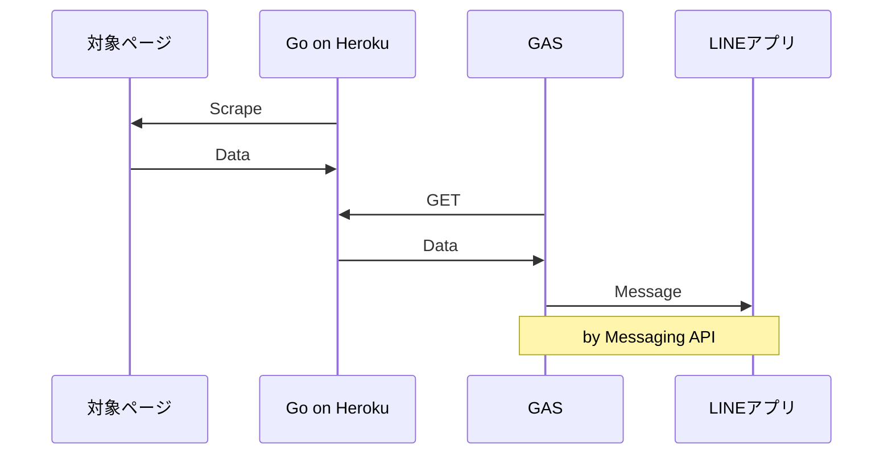

初記事です。よろしくお願いします。
# Introduction
大学入試が終わって合格発表を待ってる期間って暇ですよね (僕は暇でした) 。それで、せっかくなので高校生最後の思い出になるものを作りたいと思って、こんなことを考えました。

1. 合格発表ページをスクレイピングし合格した番号の一覧と自分の合否を調べるコードを書く
2. １のデータを返すAPIを作る
3. ２のAPIを叩いてデータを取得し、メッセージとしてLINEに送る仕組みを作る

で、合格発表時刻ちょうどに自動で１・２・３が実行されるようにしておけば、他の人間たちがアクセスしてページが重くなる前に合格発表に関する情報を取得して、ゆっくりLINEで眺めることができるというわけです。ちなみに、１でデータを取得したならそのまま直接 LINE MessagingAPI を叩けばいいところですが、「1：**Go** 入門として Go でスクレイピングしてみたい」「2：API **作って**みたい」「3：**MessagingAPI** 使ってみたい」という動機があり、２で API (ごく簡単なものですが) を作る経験をするためにこの構成にしました。
対象ページは京大工学部の合格発表ページです。また、２のホスティングには **Heroku** 、３には **GAS** を採用しました。

GAS も初めて触りましたが、これはほぼ JS でそこまで困ることなく書けたので、最終的コードを示すに留め、この記事では１のスクレイピングに焦点を当てたいと思います。

:::message
- GAS は Zenn のシンタックスハイライト未対応
- Property と Trigger (timeBased) は別ファイルで設定済
:::
```gs:main.gs
let apiURL = PropertiesService.getScriptProperties().getProperty('API_URL')
let userID = PropertiesService.getScriptProperties().getProperty('USER_ID')
let accessToken = PropertiesService.getScriptProperties().getProperty('CHANNEL_ACCESS_TOKEN')

function main() { // 3/10 12:00 実行
  // 確実にスクレイピング完了まで待つ (ちょっと長めに)
  Utilities.sleep(3 * 1000)
  let jsonData = GetJSONdata(apiURL)

  let idList = jsonData["id_list"]
   // MessagingAPI の文字数制限 (５０００文字) のため２回にわけて送る
  let message1 = idList.slice(0,501).join("\n")
  PushMessage(message1)
  let message2 = idList.slice(501).join("\n")
  PushMessage(message2)

   // 合格or不合格
  let passed = jsonData["passed"]
  let result = ""
  if (passed) {
    result = "合格"
  } else {
    result = "不合格"
  }
  PushMessage(result)
}

function AwakeHeroku(){ // 3/10 11:45 実行
  // 事前に Heroku をスリーブから叩き起こす
  UrlFetchApp.fetch(apiURL)
}


function GetJSONdata(url){
  let res = UrlFetchApp.fetch(url).getContentText()
  return JSON.parse(res)
}

function PushMessage(messageText){
  let url = 'https://api.line.me/v2/bot/message/push'
  let headers = {
    'Content-Type': 'application/json; charset=UTF-8',
    'Authorization': 'Bearer ' + accessToken,
  }
  let postData = {
    'to': userID,
    'messages': [{
      'type': 'text',
      'text': messageText,
    }]
  }
  let options = {
    'method': 'post',
    'headers': headers,
    'payload': JSON.stringify(postData)
  }
  return UrlFetchApp.fetch(url, options)
}
```

# Scraping
### 情報収集
では本題に入ります。早速ですが、重大な問題があります。勘のいい方 or 京大の先輩方は気づいたかもしれませんが、合格発表前はそもそも対象ページが**Web上に存在しない**のです。ページ自体が**合格発表のタイミングで公開される**ので、事前にURLも分かりませんし、HTMLの構造も当然分かりません。これでは話が進まないので、YouTubeで京大の合格発表ページが写り込んでいる動画を探しまくって情報収集しました。その結果分かったことは、
- 発表時刻に、[このページ](https://daigakujc.jp/pal.php?u=31&h=24)に各学科名のリンクが並ぶ (：**Aページ**とする)

*発表前*
- "工学部"のリンクで飛んだ先が工学部の発表ページ。そのURLは上記ページのURLにクエリパラメータがくっついた形をしているが、工学部のパラメータが毎年同じとは限らないかもしれないとなると、予想がつかない
- 発表ページ自体は、簡単な説明と縦に並んだ番号があるだけ (：**Bページ**とする)

*これは発表後に撮った実際の写真だが、こんな感じだということは動画で事前に確認できた*

くらいです。この条件で、発表の瞬間にBページから
- 合格した「番号+アルファベット」(：**ID** とする) (Bページ画像参照) の一覧
- 自分の合否

を取得するのが目標です。前者ができれば後者は容易なので、前者をなんとかすることを考えることになります。Go の基礎文法をざっと勉強してから、Go でのスクレイピングにはどんな package が使えるか調べてみたところ、**goquery** という package が、Github のスター数が十分多く、最終更新が去年の10月 (執筆時点) で安定してそう、かつネット上の日本語記事数の点では頭一つ抜けているように感じたので、今回はこれを採用することにしました。

### 構想
ということで、`goquery` に慣れるべくいろいろ書いてみながら、今回の目標を達成するために次のような方針を立てました。

1. Aページをスクレイピングし、「 text が"工学部"となっている a タグの href 」を取得する。
2. 必要なら href を"https://〜"の形に加工する。このURLを使うことでBページをスクレイピングすることができる。
3. Bページをスクレイピングし、合格したIDのリストを取得する。

ただし、最初に書いたようにBページの**HTMLが事前に分からない**ため、ここは想像に頼るしかないです。当然テストも不可能です。僕は、先程の写真のイメージから以下のような感じのHTMLを想定しました。

```html:bpage.html
<!--略-->
<body>
    <hN class="school">工学部</hN>
    <p>[合格者番号一覧]</p>
    <p>受験番号の後のアルファベットは、合格した学科を表す。</p>
    <p>A 地球工学科</p>
    <p>B 建築学科</p>
    <p>C 物理工学科</p>
    <p>D 電気電子工学科</p>
    <p>E 情報学科</p>
    <p>F 工業化学科</p>
    <p>0007C</p>
    <p>0010E</p>
    <p>0013C</p>
    <p>0014B</p>
    <p>0016F</p>
    <p>0019B</p>
    <p>0020F</p>
    <p>0023C</p>
    <p>0025A</p>
    <!--ID は適当-->
    <!--以下略-->
</body>
</html>
```
自分が React 好きなのもあり、 ID 部分 (**930個**くらい) は「Array を map でバラして作った JSX」のようなイメージを無意識に持っていました。今にして思えばこの思い込みがダメでした。

それはともかく、このHTMLを想定して書いた Go のコードを以下に示します。

```go:scrape.go
package main

import (
  "log"
  "regexp"
  "strings"  
  "github.com/PuerkitoBio/goquery"
  "golang.org/x/text/encoding/japanese"
  "golang.org/x/text/transform"
)

type ScrapeInfo struct {
  baseURL       string
  preScrapePath string
  examCategory  string
  examNumber    string
}
func scrape(si ScrapeInfo) ([]string, bool) {
  var (
    baseURL        = si.baseURL
    preScrapePath  = si.preScrapePath
    myExamCategory = si.examCategory
    myExamNumber   = si.examNumber
  )
  var (
    preScrapeURL  = baseURL + preScrapePath
    myCategoryURL string
  )

  // 1.
  href := findHrefOf(myExamCategory, preScrapeURL)
  // 2.
  if href[0:5] == "https" {
    myCategoryURL = href
  } else {
    myCategoryURL = baseURL + href
  }
  // 3.
  passedIDs := findPassedIDsFrom(myCategoryURL)  
  iHasPassed := false
  for _, id := range passedIDs {
    if id[0:4] == myExamNumber {
      iHasPassed = true
      break
    }
  }  
  return passedIDs, iHasPassed
}

func findHrefOf(targetWord, targetURL string) string {
  // ページ全体をドキュメントとして読み込む
  doc, err := goquery.NewDocument(targetURL)
  if err != nil {
    log.Fatal(err)
  }
  var targetHref string
  // a タグを調べ上げる
  doc.Find("a").EachWithBreak( func(i int, s *goquery.Selection) bool {
    href, exists := s.Attr("href")
    isTargetTag := (s.Text() == targetWord)  
    if exists && isTargetTag {
      targetHref = href
    }
    return !isTargetTag
    // EachWithBreak ... Each(func) しつつ、func の返り値が false のとき break
  })  
  return targetHref
}

func findPassedIDsFrom(targetURL string) []string {
  doc, err := goquery.NewDocument(targetURL)
  if err != nil {
    log.Fatal(err)
  }
  var (
    wordList  = strings.Split(doc.Text(), "\n")
    // doc.Text()...ドキュメント全体を string にしたものを返す
    // それを \n で Split して配列にしている
    passedIDs []string
    idPattern = regexp.MustCompile(`[0-2]\d{3}[A-F]`)
    // (0001〜2569) + (A〜F) なのでとりあえずこれで
  )
  for _, word := range wordList {
    id := strings.TrimSpace(word)
    if idPattern.MatchString(id) {
      passedIDs = append(passedIDs, id)
    }
  }
  return passedIDs
}
```
`func main()` が入った main.go は別ファイルですが、これは時間管理して実際のデータで `scrape()` してサーバー立ててるだけなので、ここではわざわざ立ち入らないことにします。一応 Github のリンクをおいておくので、気になる方は覗いてください。
https://github.com/kana-rus/resultinformer/tree/f2b7ef4a70b27745fa10e717104874306776f5b6/src
`findHrefOf` は適当な a タグのあるサイトを使わせていただいて、`findPassedIDsFrom` はさっきのHTMLをそれっぽくスタイリングしたものを localhost して、それぞれ疑似的に単体テストしながら書いてき、BページのHTMLがあれで合っていればこのコードでいけそうだ、という段階まで来ました。

### 文字コード問題
ある時、試しに `FindHrefOf` の内容をいじって ( a タグではなく div タグを探し、内容によらず text を全て出力させる) 、AページのURLで実行してみたところ、漢字・ひらがなの出力が「工」以外文字化けしてしまいました。`nkf` で文字コードを確認したところ、**ShiftJIS** とのこと。このサイトは文字コードが ShiftJIS でした。そこで、
https://times.hrbrain.co.jp/entry/character-code-go
https://dev.classmethod.jp/articles/golang-iconv/
あたりを参考に次の関数を作成しました。変換時のエラーは返り値にしない形をとっています。
```go:scrape.go
func convertUTF8toSjis(utf8Str string) string {
  encoder := japanese.ShiftJIS.NewEncoder()
  sjisStr, _, err := transform.String(encoder, utf8Str)
  if err != nil {
    log.Fatal(err)
  }
  return sjisStr
}
```
おそらくないとは思われますが、万が一「Bページは utf-8 だった」となっても対応できるように、最初に文字コードの判定をいれて処理を分ける形で `findHrefOf` を以下のように編集しました。

```go:scrape.go
func findHrefOf(targetWord, targetURL string) string {
  doc, err := goquery.NewDocument(targetURL)
  if err != nil {
    log.Fatal(err)
  }
  var (
    isUTF8site bool = false //default
    targetCode string
  )
  doc.Find("meta").EachWithBreak(func(i int, s *goquery.Selection) bool {
    charset, exists := s.Attr("charset")
    if exists {
      isUTF8site = (charset == "utf-8" || charset == "UTF-8")
    }
    return !exists // meta タグに utf-8 の記載があったら break
    // なければ全ての meta タグを探すことになり、isUTF8site = false のまま終了
    // まともな utf-8 ページにはこの記載があるはずなので・・・という判断
    // (ほんとはもっとちゃんと判定すべきかも)
  })
  if isUTF8site {
    targetCode = targetWord
  } else {
    targetCode = convertUTF8toSjis(targetWord)
  }

  var targetHref string
  doc.Find("a").EachWithBreak(func(i int, s *goquery.Selection) bool {
    href, exists := s.Attr("href")
    isTargetTag := (s.Text() == targetCode)
    if exists && isTargetTag {
      targetHref = href
    }
    return !isTargetTag
  })
  return targetHref
}
```
これで文字化け問題も解決し、思いつく限り意味のありそうな疑似テストが全てパスするようになったので、たぶんこれでいけるだろうということで Heroku に投入しました。
```go.mod:go.mod
// +heroku goVersion go1.17
go 1.17
```
というコメントをいれないと勝手に Heroku デフォルトバージョンの Go をインストールされてしまうなど、定番 (？) の罠に引っかかりながらも、適宜ググって解決し、無事デプロイ・実行まで辿り着きました。その後 GAS の方も実装が間に合い、あとは発表の瞬間を待つのみとなりました (発表前日の深夜) 。

そして迎えた翌朝、案の定寝過ごして 13：00 くらいに起き出して LINE を見ると・・・

### 撃沈
何のメッセージも表示されておらず、見事に撃沈してしまいました (テストしていない以上、覚悟はしてましたが) 。ちなみに入試の結果は合格でした。

まず GO の方をざっと調べてみたところスクレイピング自体がうまくできてなさそうだったので `findHrefOf` と `findPassedIDsFrom` の返り値をそれぞれ出力してみると、後者が想定外で


**\n で Split したはずなのにされてない** 、従って巨大な１つの string ができているという問題が起きていることが判明しました。

( 何も表示されていない直接の原因は実際には GAS の実装 (冒頭で出した完成形に至る前) にあり、微妙に **MessagingAPI の仕様に沿わない**ものを POST してしまっていたことによるエラーでした。考えてみれば、GO のほうで上記の問題が起きていたとしても GAS の実装が正しければこの巨大文字列がメッセージとして送られるはずなので、メッセージがない時点で GAS 側にも問題が存在するのは明らかですが、このときはそこまで頭が回りませんでした )

### 解決
Bページが公開されたので、HTMLの答え合わせをしましょう。


*これは！！？*

ということで、正解は
```html
<!--略-->
<font color="#000000">
  "[合格者受験番号一覧]"
  <br>
  "受験番号の後のアルファベットは、合格した学科を表す。"
  <br>
  "A 地球工学科"
  <br>
  "B 建築学科"
  <br>
  "C 物理工学科"
  <br>
  "D 電気電子工学科" 
  <br>
  "E 情報学科"
  <br>
  "F 工業化学科"
  <br>
  <br>
  "0002E"
  <br>
  "0005A"
  <br>
  "0010C"
  <br>
  "0011C"
  <br>
  <!--以下略-->
</font>
<!--以下略-->
```

でした 。。。( <font> と入力するとエディタ上では "font" の部分が**赤字で表示**されています )

これはさすがに予想外でした...。現象としては、<font></font> で囲まれたテキスト全てが、<**br**> を除いて１つに連結した巨大な文字列になっていて、それは (当然 ID を (930 個くらい) 含むため) idPattern にマッチするので、 `findPassedIDsFrom` の返り値としてそれが返ってきている、ということのようです (@"_")

この分析をもとに `findPassedIDsFrom` を書き直します。もとの `findPassedIDsFrom`

```go:scrape.go
func findPassedIDsFrom(targetURL string) []string {
  doc, err := goquery.NewDocument(targetURL)
  if err != nil {
    log.Fatal(err)
  }
  var (
    wordList  = strings.Split(doc.Text(), "\n")
    passedIDs []string
    idPattern = regexp.MustCompile(`[0-2]\d{3}[A-F]`)
  )
  for _, word := range wordList {
    id := strings.TrimSpace(word)
    if idPattern.MatchString(id) {
      passedIDs = append(passedIDs, id)
    }
  }
  return passedIDs
}
```
の返り値があの巨大文字列なので、この文字列をさらに加工して配列
```go
{"0002E", "0005A", "0010C", "0011C", /*以下略*/}
```
を得る方針でいきます。

```go:scrape.go
func findPassedIDsFrom(targetURL string) []string {
  doc, err := goquery.NewDocument(targetURL)
  if err != nil {
    log.Fatal(err)
  }

  var (
    idPattern  = regexp.MustCompile(`[0-2]\d{3}[A-F]`)
    targetText string
  )
  // 最初から font タグを探して効率よく巨大文字列を得る
  doc.Find("font").EachWithBreak(func(i int, s *goquery.Selection) bool {
    str := s.Text()
    targetText = str
    return !idPattern.MatchString(str)
    // 返り値が false になったら (str が idPattern にマッチしたら) 終了
    // そもそも１つ (巨大文字列) しかマッチしないのでこれでよい
  })

  var idStartAt int
  // ID が巨大文字列のどこから現れ始めるか調べる
  // ごく最初の方から始まるはずなので、単純に前から見ていく
  for i, rune := range targetText {
    if string(rune) == "0" /* 0002E の 0 */ {
      idStartAt = i
      break
    }
  }

  var (
    idBuilder    strings.Builder
    passedIDlist []string
  )
  // const idLen = 5
  // 今いるのが ID の何文字目か (0,1,2,3,4) 数えながら繋げていく
  // 5 文字繋がるごとに passedIDlist に入れ、0 文字目から数え直す
  position := 0
  for i, rune := range targetText {
    str := string(rune)

    if i >= idStartAt {

      // 終了条件 (そこからは ID じゃない条件)
      // (最後の「以上〜名」という漢字で引っかかる)
      if rune > 'F' /* >'E'> ... >'2'>'1'>'0' */ {
        break
      }

      idBuilder.WriteString(str)
      if position == 4 {
      	passedIDlist = append(passedIDlist, idBuilder.String())
      	idBuilder.Reset()
      	position = -1
      }
      position++
    }
  }

  return passedIDlist
}
```
けっこう試行錯誤した結果ですが、これでうまくいくし、それなりにきれいにまとまってると思います。

これで heroku に再 `push` し、前述した GAS の問題を解決すると、今度は別のエラーが出てきました。これが今回のラスボス、**文字数制限**です。

１メッセージあたり text は 5000 文字以下でなければならないという制限であり、`passedIDlist` を一度に送ると
```txt
ID １つあたり ID + \n で 5 + 1 = 6 (文字) なので、全体で
    6 * 930  >  6 * 900 = 5400  >  5000 (文字)
```
となり引っかかってしまいます。ID を何個かずつくっつけて１行に入れていくことで \n を削って文字数を抑える、といった方法も考えましたが見づらくなるので、最終的には**単純に適当なところで分割して２回送ればいい**だろうと考え、冒頭のコードが完成しました。その結果、


*やった！！*

ということで、ようやく成功しました。最後まで読んでいただきありがとうございます。